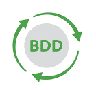
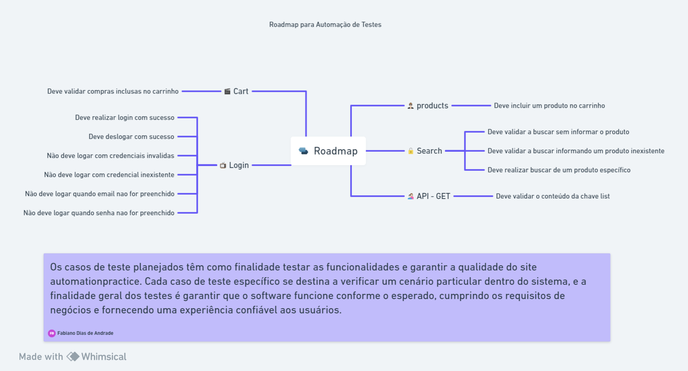

## Sobre

Repositório teste-automacao-coe-de-qualidade e2e

## Stacks
- Cypress
- Javascript

## Rodando

1. Clonar o repositório, instalar as dependências
```
npm install
```

2. Subir o Cypress UI
```
npx cypress open 
```

3. Executar testes em Headless
```
npx cypress run 
```
### Ambiente de Testes:

-   url: http://www.automationpractice.pl
-   email: teste2021@teste.com.br
-   senha: teste

### Roadmap de automação de testes:

<p align="center">
  <h6 align="center">Testes do projeto</h6>
  <a href="BDD.md">
    
  </a>
</p>


---




